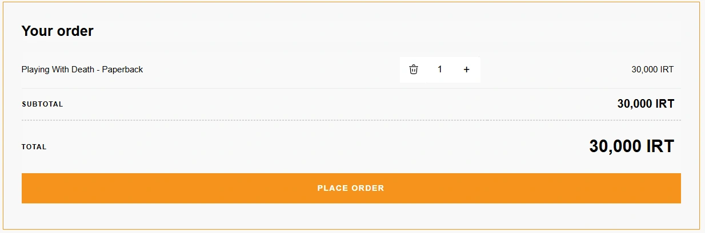
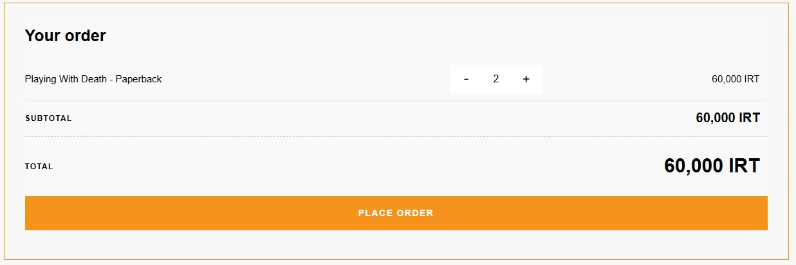

# Checkout Quantity Update for Hub WP Theme

A WordPress plugin to enable quantity adjustment for products on the WooCommerce checkout page, specifically designed for the Hub theme.

## Preview EN

| One item in cart | Multiple items in cart |
| --- | --- |
|  |  |

## Features

- Add a quantity adjustment field next to the product name on the checkout page
- Automatically recalculate prices when product quantities are updated
- Remove a product by clicking the decrease button when the quantity reaches 1
- Compatible with dark mode
- Beautiful design aligned with the Hub theme

## Installation

1. Upload the plugin files to the `/wp-content/plugins/checkout-quantity-update` directory
2. Activate the plugin through the "Plugins" menu in WordPress
3. Done! The plugin will automatically be enabled on the checkout page

## Requirements

- WordPress 5.0 or higher
- WooCommerce 3.0 or higher
- Hub theme

## Support

For reporting issues or suggesting features, use the Issues section in the GitHub repository:

https://github.com/MatinKhamooshi/checkout-quantity-update-for-hub-theme/

## Developer

Developed by [Matin Khamooshi](https://matinkhamooshi.ir) + AI

---

# تغییر تعداد محصولات سبد خرید در صفحه تسویه حساب (ویژه قالب هاب)

یک افزونه وردپرس برای اضافه کردن امکان تغییر تعداد محصولات در صفحه تسویه حساب ووکامرس برای قالب Hub.

## ویژگی‌ها

- اضافه کردن فیلد تغییر تعداد محصول در کنار نام محصول در صفحه تسویه حساب
- محاسبه مجدد خودکار قیمت‌ها با تغییر تعداد محصولات 
- امکان حذف محصول با کلیک روی دکمه کاهش وقتی تعداد به 1 می‌رسد
- سازگار با حالت تاریک (دارک مود)
- طراحی زیبا و هماهنگ با قالب Hub

## نصب

1. فایل‌های افزونه را در پوشه
`/wp-content/plugins/checkout-quantity-update`
آپلود کنید
2. از منوی "افزونه‌ها" در پیشخوان وردپرس، افزونه را فعال کنید
3. تمام! افزونه به صورت خودکار در صفحه تسویه حساب فعال می‌شود

## پیش‌نیازها

- وردپرس 5.0 یا بالاتر
- ووکامرس 3.0 یا بالاتر
- قالب Hub

## پشتیبانی

برای گزارش مشکلات یا پیشنهادات خود می‌توانید از بخش Issues در مخزن گیت‌هاب استفاده کنید:

https://github.com/MatinKhamooshi/checkout-quantity-update-for-hub-theme/

## توسعه‌دهنده

توسعه یافته توسط [Matin Khamooshi](https://matinkhamooshi.ir) + AI